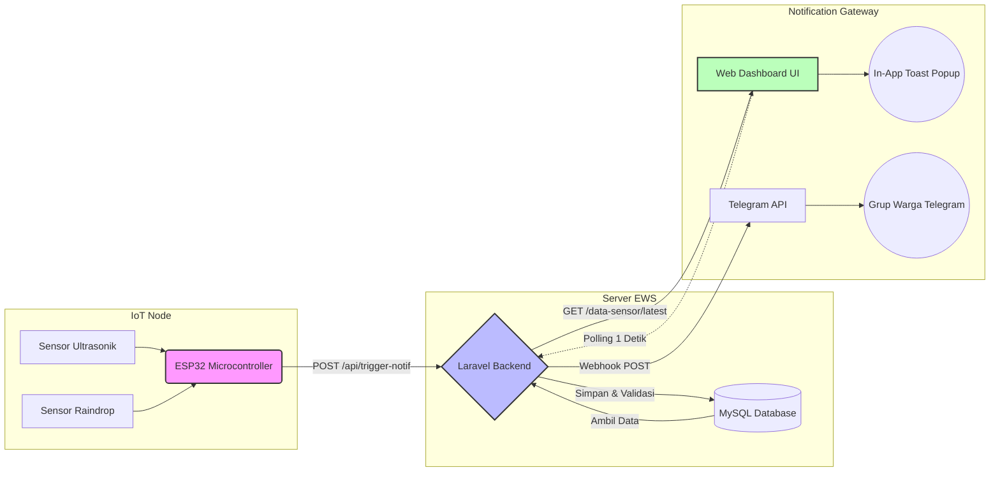

# Lampiran Gambar, Tabel, dan Diagram Pendukung Laporan

File ini berisi seluruh materi visual (tabel dan diagram) yang dapat Anda gunakan untuk mengisi bagian *placeholder* **[MASUKKAN...]** pada dokumen teks laporan utama Anda.

---

## 1. Topologi Arsitektur Keseluruhan
*(Gunakan fitur Mermaid pada aplikasi Markdown/Notion Anda untuk me-render kode ini menjadi gambar, atau Anda dapat membuat bagannya di Microsoft Visio / draw.io berdasarkan alur di bawah ini).*

---

## 2. Tabel Spesifikasi API POST / Ingest Data
*(Salin tabel ini ke Microsoft Word Anda).*

| Parameter / Keterangan | Detail Spesifikasi |
| :--- | :--- |
| **Fungsi / Deskripsi** | Mengirim data pembacaan sensor berkala dari perangkat IoT ke Server Pusat. |
| **URL Endpoint** | `http://[IP-Server]/api/trigger-notif` |
| **HTTP Method** | `POST` |
| **Header** | `Content-Type: application/json` `Accept: application/json` |
| **Request Body (JSON)** | `mac_address` (String): Alamat fisik modul Wi-Fi ESP32. `distance` (Float): Jarak ketinggian air dari sensor (cm). `rain_val` (Integer): Nilai analog sensor curah hujan (0 - 4095). |
| **Response Success (200 OK)** | `{"success": true, "message": "Data tersimpan dan dievaluasi.", "data": {"status": "BAHAYA", "cuaca": "HUJAN"}}` |
| **Pemicu Internal** | Menyimpan ke tabel `sensor_logs`. Jika status anomali, mengeksekusi layanan `NotificationService`. |

---

## 3. Tabel Spesifikasi API GET / Polling Dashboard
*(Salin tabel ini ke Microsoft Word Anda).*

| Parameter / Keterangan | Detail Spesifikasi |
| :--- | :--- |
| **Fungsi / Deskripsi** | Menarik 1 baris data sensor paling mutakhir (terbaru) untuk sinkronisasi Web Dashboard UI secara *Real-Time*. |
| **URL Endpoint** | `http://[IP-Server]/data-sensor/latest` |
| **HTTP Method** | `GET` |
| **Header** | `Accept: application/json` |
| **Request Parameters** | *(Tidak ada / Kosong)* |
| **Response Success (200 OK)** | `{"jarak": 18.5, "hujan": "Hujan", "waktu": "2026-05-05 10:00:00"}` |
| **Pemicu Internal** | Dieksekusi otomatis oleh skrip JavaScript (`Fetch API`) dari sisi klien secara berulang setiap 1000 milidetik (1 detik). |

---

## 4. Tabel Kategori Status dan Ambang Batas (Threshold)
*(Salin tabel ini ke Microsoft Word Anda).*

| Variabel Sensor | Nilai Pembacaan (*Threshold*) | Klasifikasi Status | Indikator Visual (Warna) | Aksi Sistem Otomatis |
| :--- | :--- | :--- | :--- | :--- |
| **Jarak Air** (Ultrasonik) | `> 60 cm` | **AMAN** | Hijau | Menyimpan log data. |
| **Jarak Air** (Ultrasonik) | `> 20 cm` dan `<= 60 cm` | **WASPADA** / SIAGA | Kuning | Menyimpan log, mengirim peringatan Telegram, menampilkan Popup UI. |
| **Jarak Air** (Ultrasonik) | `<= 20 cm` | **BAHAYA** / DARURAT | Merah | Menyimpan log, menyiarkan peringatan Telegram massal, membunyikan alarm OS, menampilkan Popup UI. |
| **Intensitas Hujan** (Raindrop) | `>= 1400` (Analog) | **CERAH** | Hijau / Abu-abu | *(Tidak ada intervensi khusus).* |
| **Intensitas Hujan** (Raindrop) | `< 1400` (Analog) | **HUJAN** | Biru | Mengirim status Cuaca Hujan ke Telegram dan memunculkan Popup UI Peringatan Cuaca. |

---

## 5. Gambar / Screenshot Notifikasi (Panduan)
*(Karena gambar ini berbasis visual riil proyek Anda, silakan ambil gambar mandiri menggunakan tombol **PrtScn** atau **Snipping Tool** pada laptop Anda).*

**A. Kebutuhan Gambar 1: In-App Toast Notification**
*   **Cara Mengambil Gambar:** Buka Dashboard Web Anda di browser. Simulasikan pengiriman data bahaya (jarak air < 20 cm). Saat *popup box* merah muncul melayang di pojok kanan bawah bertuliskan "🚨 BAHAYA BANJIR!", segera *screenshot*.

**B. Kebutuhan Gambar 2: Telegram Bot Notification**
*   **Cara Mengambil Gambar:** Buka grup Telegram di HP atau Telegram Web Anda. *Screenshot* format pesan yang memuat detail: Status, Jarak Air, Kondisi Cuaca, dan Waktu yang dikirimkan oleh Bot.

---

## 6. Tabel Contoh Hasil Pengujian UAT (Uji Kecepatan / Latency)
*(Tabel di bawah ini adalah contoh kerangka pengujian performa End-to-End. Silakan sesuaikan angkanya dengan hasil pengujian aktual Anda).*

| Skenario Pengujian UAT (Response Time) | Ekspektasi Waktu | Hasil Uji (Simulasi) | Status Uji |
| :--- | :--- | :--- | :--- |
| Pengiriman Data: ESP32 $\rightarrow$ API Endpoint Server | $< 1$ Detik | `0.4 Detik` | ✅ Lulus |
| Pemrosesan Database & Pengecekan Threshold Server | $< 1$ Detik | `0.1 Detik` | ✅ Lulus |
| Visualisasi Dashboard (Polling Sync Jarak Air & Cuaca) | $\pm 1$ Detik | `1.2 Detik` | ✅ Lulus |
| Penyiaran Notifikasi: Server $\rightarrow$ Grup Warga Telegram | $< 3$ Detik | `1.5 Detik` | ✅ Lulus |
| **Total Waktu Latensi Respons (End-to-End)** | **$< 5$ Detik** | **`3.2 Detik`** | **✅ Lulus** |
